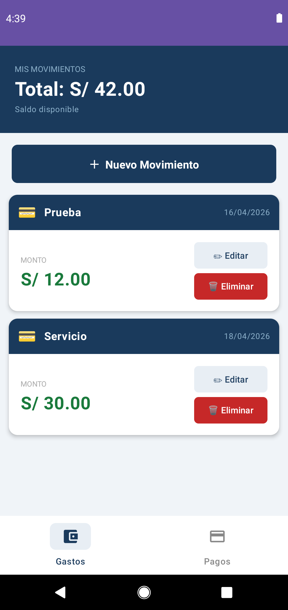
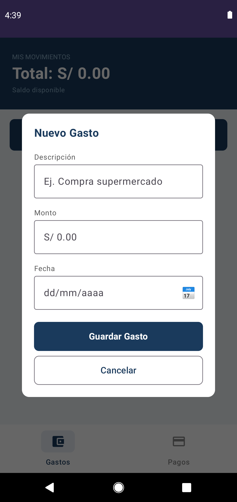
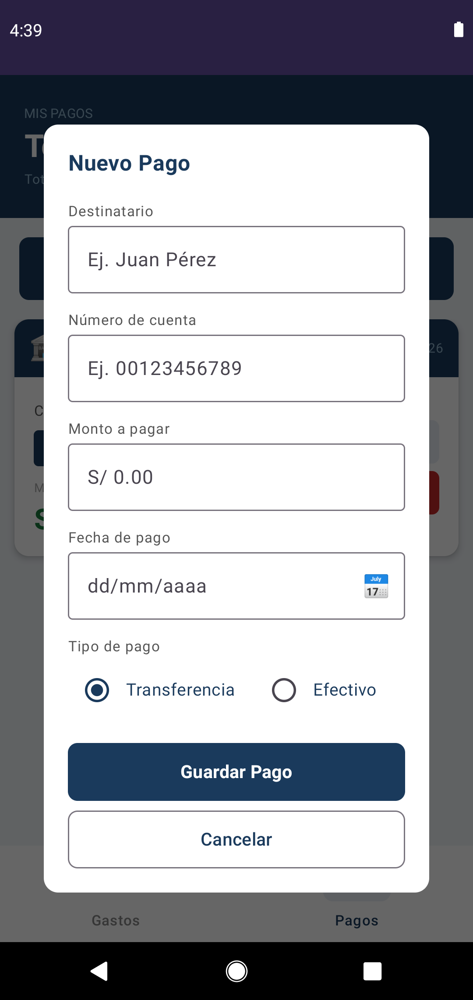

## AppCrud
AppCrud es una aplicación Android nativa desarrollada con Jetpack Compose que permite gestionar gastos y pagos personales de forma sencilla e intuitiva, con una interfaz estilo bancario y persistencia de datos local.
## Instalación
1. Clonar repositorio
```bash
git clone https://github.com/tu-usuario/AppCrud.git
```
2. Abrir en Android Studio
3. Sincronizar dependencias de Gradle
4. Correr en emulador o dispositivo físico
## Estructura del proyecto
```
app/
├── src/
│   └── main/
│       ├── java/com/example/appcrud/
│       │   ├── MainActivity.kt          # Entry point - pantalla Gastos
│       │   ├── PagosActivity.kt         # Entry point - pantalla Pagos
│       │   ├── GastosScreen.kt          # UI, lista, tarjetas y modal de Gastos
│       │   ├── PagosScreen.kt           # UI, lista, tarjetas y modal de Pagos
│       │   ├── BottomNavBar.kt          # Navegación inferior (Gastos / Pagos)
│       │   ├── Gasto.kt                 # Modelo de datos - Gasto
│       │   ├── Pago.kt                  # Modelo de datos - Pago
│       │   ├── GastoAdapter.kt          # Adapter RecyclerView Gastos
│       │   ├── PagoAdapter.kt           # Adapter RecyclerView Pagos
│       │   ├── JsonHelper.kt            # Persistencia JSON - lee y guarda Gastos
│       │   └── JsonHelperPagos.kt       # Persistencia JSON - lee y guarda Pagos
│       ├── res/                         # Recursos (Imágenes, Textos, Estilos)
│       └── AndroidManifest.xml          # Configuración principal de Android
├── build.gradle.kts                     # Configuración de dependencias
├── settings.gradle.kts                  # Configuración de módulos
└── gradle.properties                    # Propiedades globales de compilación
```
## Pantallazos
### Pagos

| Listado | Crear | Editar | Eliminar |
|--------|------|--------|----------|
|  |  |  |  |
## Tecnologías 

1. Kotlin 1.9+
2. Jetpack Compose BOM 2024+
3. Material 3 1.2+
4. Gson 2.10+
5. Android SDK API 30+

## Tarea de investigación: Conceptos Android 

### AndroidManifest.xml  
Es el archivo central de configuración de una aplicación Android, donde se declara la información esencial del proyecto, como componentes, permisos y servicios.

### Carpeta `res`  
Directorio donde se almacenan los recursos de la aplicación, como layouts, imágenes, colores, textos y estilos.

### Gson  
Librería que permite convertir datos JSON en objetos Kotlin/Java (serialización y deserialización).

### Clean Architecture  
Modelo que organiza la aplicación en capas independientes:

- **Presentation:** Maneja la interfaz de usuario (UI, Activities, Compose)  
- **Domain:** Contiene la lógica de negocio y casos de uso  
- **Data:** Gestiona el acceso a datos. En este proyecto se utiliza JSON como fuente de datos, procesado mediante Gson  
- **Infrastructure:** Implementaciones externas y servicios  
- Data: Gestiona el acceso a datos. En este proyecto se utiliza JSON como fuente de datos, procesado mediante Gson para la serialización y deserialización de la información  
- Infrastructure: Implementaciones externas y servicios 
